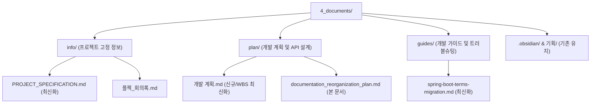

# ZIPT 프로젝트 문서 구조 재정비 및 콘텐츠 업데이트 계획

이 계획은 `C:\KOSTA_Projects\4_ZIPT_Project\4_documents` 하위에 흩어져 있는 기획, 회의록, 개발 로그, 문제 해결 문서 등을 현재 프로젝트 상황(Frontend/Backend 개발 진행 현황 및 브랜치 상태)에 맞춰 구조화하고, 핵심 문서들의 내용을 최신화하기 위해 수립되었습니다.

> [!NOTE]
> 사용자의 요청에 따라 캡처 이미지에 포함된 루트 수준의 파일 및 폴더(`temp`, `기획`, `Backend_log.md`, `Backend_troubleshooting.md`, `Frontend_log.md`, `header_footer_config_plan.md`, `terms_api_remaining_notes.md`, `부동산 핵심 용어 정리표_주택도시보증공사(HUG).xlsx`)는 이동 또는 삭제하지 않고 원본 위치를 보존합니다.

---

## 프로젝트 현재 상황 분석 요약

1. **기술 스택**:
   - **Backend (`back_zipt`)**: Spring Boot (Gradle 빌드), JPA, PostgreSQL/H2.
   - **Frontend (`front_zipt`)**: React + Vite (Zustand 상태 관리, SCSS 디자인 토큰).
2. **개발 진행 현황**:
   - **백엔드 (`feature/terms` 브랜치)**: HUG 제공 부동산 핵심 용어 엑셀 파일(80개)을 `terms.json` 시드로 정제 완료 및 `RealEstateTerm` JPA 엔티티와 용어 도메인 패키지 구현 완료.
   - **프론트엔드 (`feature/frontEdit` 브랜치)**: 기존 레거시 코드에서 `Header`, `Footer`, Zustand 인증 스토어(`useAuthStore`), 테마 디자인 토큰(`tokens.scss`) 이관 및 빌드 검증 완료.
3. **남은 해결 과제**:
   - 백엔드 `SecurityConfig`에 용어 API 공개 경로(`permitAll`) 추가 여부 검토 필요.
   - 로컬 테스트 실행 시 AWS S3 credentials 누락으로 인한 전역 테스트 실패 건 예외 처리 또는 설정 보완 필요.
   - 백엔드-프론트엔드 간 CORS 해소를 위해 Vite 프록시 설정 연동 확인.

---

## 폴더 구조 정비 방안 (참조 목적 구조화)

문서의 성격에 따라 **Info(정보)**, **Plan(계획)**, **Guides(가이드)** 로 분류하고, 비어 있거나 최신화가 필요한 문서들을 업데이트합니다.

---

## 문서 콘텐츠별 상세 정비 및 최신화 계획

### 1. [PROJECT_SPECIFICATION.md](file:///C:/KOSTA_Projects/4_ZIPT_Project/4_documents/info/PROJECT_SPECIFICATION.md) 최신화
- **내용**: ZIPT 서비스 개요, 타겟 페르소나, 핵심 기능 정의(층간소음, 체크리스트, 시뮬레이션, AI 권리분석 등), 그리고 현재 완료된 '부동산 용어 사전' API 명세 통합.

### 2. [spring-boot-terms-migration.md](file:///C:/KOSTA_Projects/4_ZIPT_Project/4_documents/guides/spring-boot-terms-migration.md) 최신화
- **내용**: `feature/terms`와 `feature/frontEdit` 구현 결과를 반영하고, 프론트엔드-백엔드 간 API 통신을 위한 로컬 Vite Proxy 설정 연동 방법 및 AWS S3 credentials 누락에 따른 로컬 테스트 실패 시 해결 방안(검증 명령 포함) 추가.

### 3. [개발 계획.md](file:///C:/KOSTA_Projects/4_ZIPT_Project/4_documents/plan/개발 계획.md) 생성 및 최신화
- **내용**: 기존 `기획/개발 계획.md`를 바탕으로 마일스톤을 갱신. 이미 완수된 내역(Header/Footer 이관, 용어 API 개발)을 완료 처리하고, 배포 준비 및 AI 분석 기능 등 향후 WBS 상세화.
