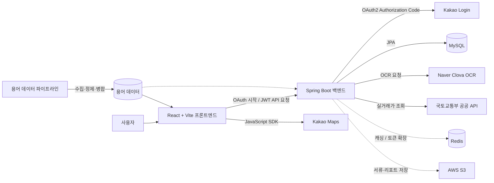
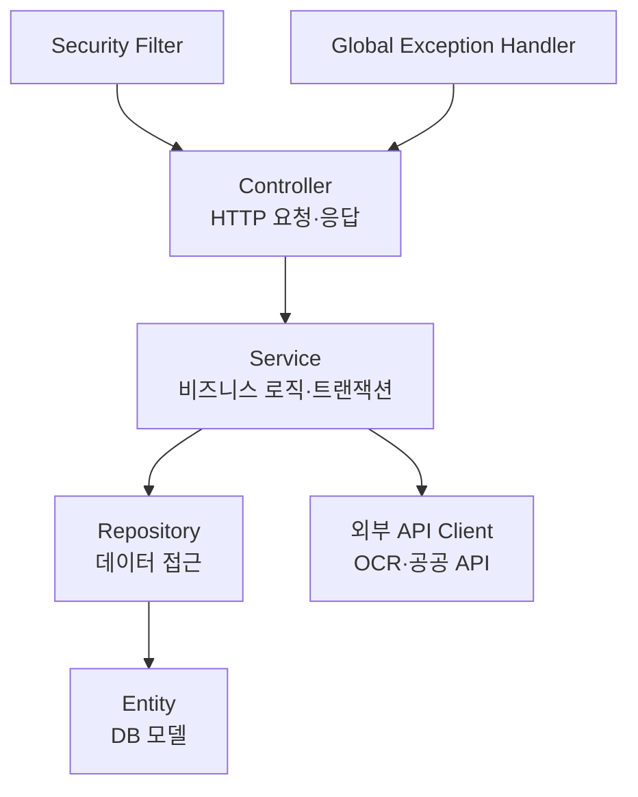
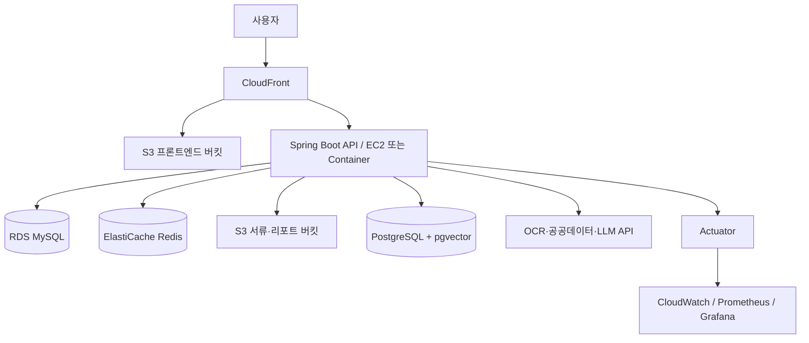
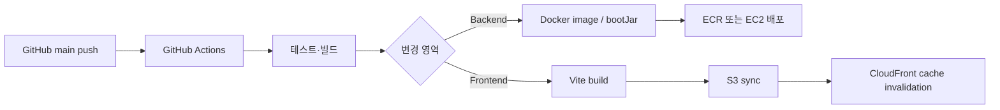
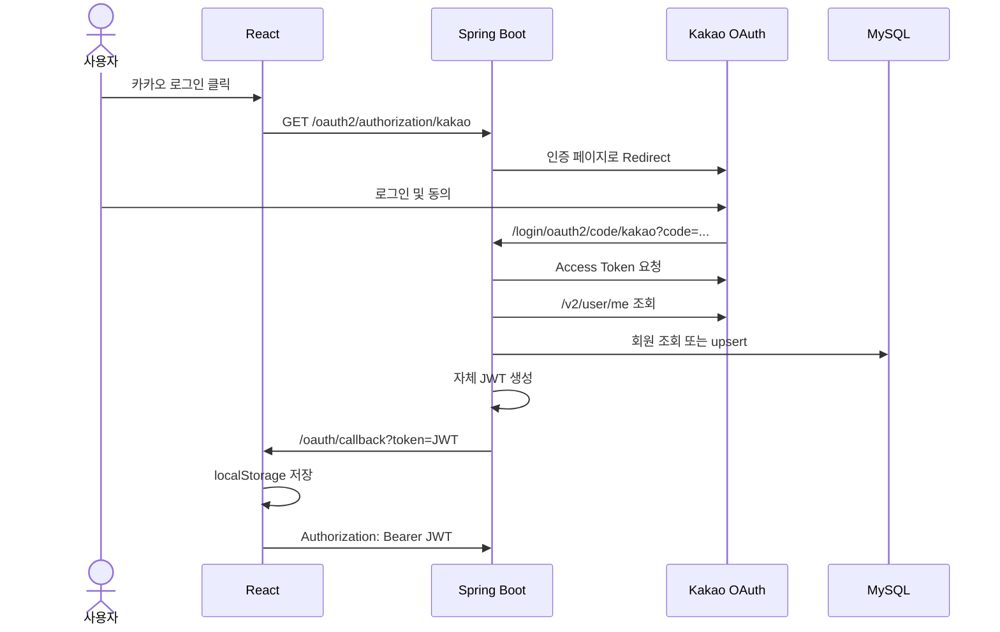
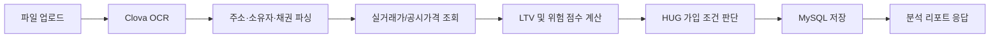
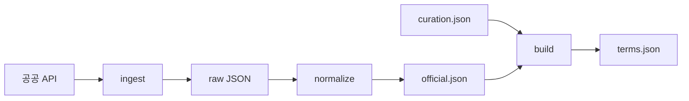
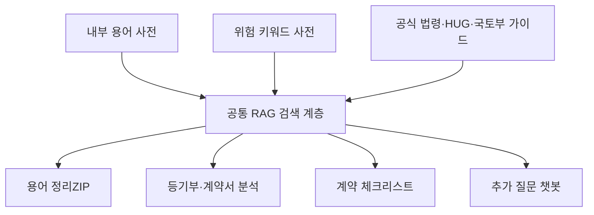
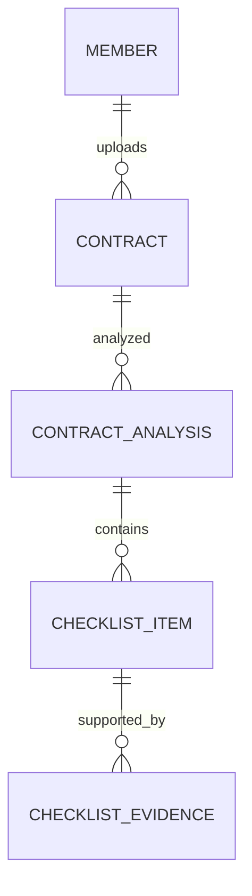

# ZIPT 프로젝트 기획 발표 문서

> 작성 기준일: 2026-06-19
> 프로젝트명: ZIPT
> 주제: 사회초년생과 부동산 초보자를 위한 전세 계약 안전 분석 서비스

---

## 1. 프로젝트 한눈에 보기

### 1.1 한 줄 소개

**ZIPT는 어려운 전세 계약 정보를 쉬운 말로 바꾸고, 등기부등본과 매물 정보를 분석하여 사용자가 전세사기 위험을 사전에 판단하도록 돕는 서비스이다.**

### 1.2 기획 배경

전세 계약을 처음 경험하는 사용자는 다음과 같은 어려움을 겪는다.

- 등기부등본의 갑구·을구, 근저당권, 선순위채권 등의 용어가 어렵다.
- 보증금과 선순위채권을 시세와 비교하여 위험도를 계산하기 어렵다.
- HUG 전세보증보험 가입 가능 조건을 스스로 판단하기 어렵다.
- 매물 주변의 교통·병원·생활편의시설을 여러 지도 서비스에서 따로 검색해야 한다.
- 분석 결과와 계약 관련 서류를 한곳에서 보관하고 다시 확인하기 어렵다.

ZIPT는 이 문제를 다음 네 가지 방향으로 해결한다.

1. **서류 분석**: 등기부등본에서 핵심 정보를 추출한다.
2. **위험 계산**: LTV, 선순위채권, 보증금, 공시가격 등을 기준으로 위험도를 계산한다.
3. **쉬운 설명**: 어려운 부동산 용어와 분석 결과를 초보자 관점에서 설명한다.
4. **생활 정보 통합**: 매물 주변 인프라와 개인 선호 조건을 함께 보여준다.

### 1.3 주요 사용자

- 첫 전세 계약을 준비하는 사회초년생
- 부동산 법률·금융 용어가 익숙하지 않은 사용자
- 전세보증보험 가입 가능 여부를 미리 확인하고 싶은 사용자
- 여러 매물의 안전성과 생활 인프라를 함께 비교하려는 사용자

### 1.4 서비스 핵심 가치

| 핵심 가치 | 설명 |
|---|---|
| 이해 가능성 | 전문 용어를 쉬운 말과 행동 지침으로 변환한다. |
| 사전 예방 | 계약 전 위험 요소를 발견하여 전세사기 가능성을 낮춘다. |
| 통합 경험 | 서류, 위험도, 보증보험, 생활 인프라를 한 흐름에서 확인한다. |
| 개인화 | 사용자의 이동 방식과 생활 선호에 맞춰 주변 환경을 제공한다. |
| 기록 관리 | 분석 결과를 회원 계정에 저장하고 다시 확인할 수 있도록 설계한다. |

---

## 2. 시스템 아키텍처

### 2.1 전체 구조



실선은 현재 코드에서 구현 또는 연결된 흐름이고, 점선은 의존성과 구조는 준비되어 있으나 추가 구현이 필요한 흐름이다.

### 2.2 저장소 분리 전략

프로젝트는 프론트엔드와 팀 통합 백엔드를 별도 저장소로 관리한다.

| 저장소 | 역할 | 주요 브랜치 |
|---|---|---|
| `1-ZIPT/front_zipt` | React 프론트엔드, UI 목업, 용어 데이터 파이프라인, 초기 API 프로토타입 | `front/doyeon` |
| `1-ZIPT/back_zipt` | 팀 통합 Spring Boot 백엔드, 회원·인증·서류 분석·DB 연동 | `Feature/OAuth` 등 기능 브랜치 |

`front_zipt/backend`는 용어 API와 프론트 API 계약을 빠르게 검증하기 위해 만든 **프로토타입 백엔드**이다. 최종 팀 백엔드는 `back_zipt`이며, 장기적으로 용어 API도 `back_zipt`로 이관해야 한다.

### 2.3 계층 구조

백엔드는 일반적인 Controller-Service-Repository 구조를 사용한다.



프론트엔드는 기존 목업 화면을 유지하면서 API 계층을 분리하는 점진적 마이그레이션 구조이다.

```text
frontend/src
├─ legacy/                 # 현재 화면 컴포넌트와 목업 기반 UI
├─ features/               # 도메인별 API 및 새 기능 코드
│  ├─ member/
│  ├─ analysis/
│  ├─ contract/
│  ├─ map/
│  ├─ terms/
│  └─ board/
├─ shared/api/             # 공통 HTTP/JWT API 계층
├─ mocks/                  # 목업 repository
├─ styles/                 # 디자인 토큰과 반응형 레이아웃
└─ main.jsx                # 앱 진입점과 레거시 호환 계층
```

### 2.4 목표 운영 인프라

다음 구조는 현재 로컬 구현이 아니라, 서비스 운영 단계에서 목표로 하는 인프라 구성이다.



| 구성 요소 | 목표 역할 | 현재 상태 |
|---|---|---|
| S3 + CloudFront | React 정적 파일 배포와 CDN 제공 | 설계 단계 |
| EC2 또는 Container | Spring Boot 실행 | 설계 단계 |
| RDS MySQL | 회원·분석·계약 데이터 저장 | 로컬 MySQL 구현 |
| ElastiCache Redis | Refresh Token, 블랙리스트, 외부 API 캐시 | 의존성·Compose 준비 |
| S3 파일 버킷 | 등기부·계약서·PDF 저장 | 설정 구조 준비 |
| PostgreSQL + pgvector | 용어·법령·가이드 RAG 검색 | 로드맵 |
| CloudWatch/Grafana | 로그·지표·장애 감지 | Actuator 기반 확장 예정 |

Redis는 논리적으로 용도를 분리한다.

- DB0 또는 인증 namespace: Refresh Token과 로그아웃 블랙리스트
- DB1 또는 캐시 namespace: 시세·층간소음·외부 API 결과 캐시

### 2.5 목표 CI/CD 흐름



목표 workflow:

- `backend-deploy.yml`: Java 21 설정, Gradle 테스트·빌드, 이미지 배포, 서버 재시작
- `frontend-deploy.yml`: Node 설정, `npm ci`, Vite build, S3 동기화, CloudFront 캐시 무효화
- RAG가 별도 서비스인 경우 `rag-deploy.yml`, Spring AI 내부 모듈로 통합하면 백엔드 workflow에 포함

현재 저장소에는 이 전체 workflow가 완성되어 있지 않으므로 발표에서는 **배포 계획**으로 설명한다.

---

## 3. 저장소별 상세 구조

### 3.1 프론트엔드 저장소

```text
front_zipt
├─ frontend/
│  ├─ src/
│  │  ├─ legacy/          # 홈, 분석, HUG, 용어, 지도, 마이페이지
│  │  ├─ features/        # 도메인별 API 및 카카오맵/OAuth 코드
│  │  ├─ shared/api/      # 공통 API client
│  │  ├─ mocks/           # 목업 데이터 접근 계층
│  │  └─ styles/          # 디자인 토큰, 상단 고정 메뉴, 반응형 CSS
│  └─ index.html
├─ pipeline/              # 공공 용어 수집·정제·병합 파이프라인
├─ zipt/terms.json        # 프론트가 사용하는 최종 용어 데이터
├─ backend/               # 용어 API 및 계약 검증용 Spring Boot 프로토타입
└─ docs/                  # 기획·구현·마이그레이션 문서
```

### 3.2 팀 통합 백엔드 저장소

```text
back_zipt/src/main/java/com/zipt
├─ config/
│  ├─ SecurityConfig.java
│  ├─ SwaggerConfig.java
│  └─ WebConfig.java
├─ domain/
│  ├─ member/
│  │  ├─ controller/
│  │  ├─ entity/
│  │  ├─ repository/
│  │  └─ service/
│  └─ analysis/
│     ├─ controller/
│     ├─ dto/
│     ├─ entity/
│     ├─ repository/
│     └─ service/
└─ global/
   ├─ exception/
   ├─ response/
   └─ security/
```

도메인 단위로 패키지를 분리하여 회원·인증과 서류 분석 기능이 서로의 내부 구현에 과도하게 의존하지 않도록 설계했다.

### 3.3 목표 백엔드 도메인 구조

현재 구현된 `member`, `analysis`를 기준으로 다음 도메인까지 확장하는 구조를 계획한다.

| 도메인 | 책임 | 구현 상태 |
|---|---|---|
| `member` | OAuth, JWT, 회원 정보, 탈퇴 | 카카오 로그인·내 정보 구현 |
| `analysis` | 등기부 OCR, 시세, LTV, HUG, 이력 | 핵심 서비스 구현 |
| `contract` | 임대차계약서 OCR, 위험 체크리스트, 특약 | 데이터 모델 설계 |
| `map` | 인프라·매물 마커 API | 프론트 SDK 우선 구현 |
| `board` | 게시글 CRUD | API 계약 예약 |
| `glossary` | 용어 검색·출처 관리 | 별도 프로토타입 구현 |
| `global.jwt` | Access/Refresh Token | Access Token 구현 |
| `global.redis` | Refresh Token·블랙리스트·캐시 | 계획 |
| `global.s3` | 파일 업로드·삭제·presigned URL | 계획 |
| `global.rag` | 검색·근거 추출·답변 생성 | 계획 |

목표 구조에서는 외부 API 구현을 Service 내부에 직접 확산시키지 않고, 도메인 서비스 또는 전용 client 계층 뒤로 분리한다. 이를 통해 Clova OCR이나 LLM 공급자를 교체하더라도 Controller와 핵심 도메인 로직의 변경을 줄인다.

---

## 4. 기술 스택

### 4.1 프론트엔드

| 기술 | 버전/형태 | 사용 목적 |
|---|---|---|
| React | 18.3.1 | 화면 컴포넌트와 상태 관리 |
| React DOM | 18.3.1 | 브라우저 렌더링 |
| Vite | 7.2.2 | 개발 서버, 번들링, 환경변수 관리 |
| JavaScript ES Module | ESM | 기능별 모듈 분리와 동적 import |
| CSS Design Tokens | Custom CSS | 색상, 간격, 반응형 레이아웃, 상단 고정 메뉴 |
| Kakao Maps JavaScript SDK | 외부 SDK | 지도, 주소 좌표 변환, 주변 시설 검색 |
| Browser localStorage | Web API | 자체 JWT 저장 |

별도의 대규모 UI 라이브러리를 도입하지 않고, 서비스의 도메인에 맞는 디자인 토큰과 컴포넌트를 직접 구성했다.

### 4.2 백엔드

| 기술 | 버전/형태 | 사용 목적 |
|---|---|---|
| Java | 21 | 백엔드 애플리케이션 언어 |
| Spring Boot | 3.5.15 | 웹 애플리케이션과 자동 설정 |
| Spring MVC | Starter Web | REST API 구현 |
| Spring WebFlux WebClient | WebFlux | OCR·공공 API 비동기/외부 HTTP 호출 |
| Spring Security | Security | API 접근 제어와 보안 필터 체인 |
| Spring OAuth2 Client | OAuth2 Client | 카카오 Authorization Code 로그인 |
| Spring Data JPA | JPA/Hibernate | 엔티티 매핑과 DB 접근 |
| JJWT | 0.12.6 | 자체 Access Token 생성·검증 |
| MySQL | 8.0 | 회원과 분석 결과 영속 저장 |
| Redis | 7.2 / 의존성 준비 | 캐싱, Refresh Token, 로그아웃 블랙리스트 확장 |
| Lombok | Annotation Processor | 반복 코드 감소 |
| Springdoc OpenAPI | 2.5.0 | Swagger API 문서화 |
| Spring Boot Actuator | Actuator | 상태 확인과 모니터링 확장 |
| H2 | Test Runtime | 독립적인 Spring 컨텍스트 테스트 |
| Gradle | Wrapper | 빌드와 의존성 관리 |

### 4.3 데이터·외부 서비스·인프라

| 기술/서비스 | 사용 목적 | 현재 상태 |
|---|---|---|
| Kakao Login | 회원가입·로그인 | 구현 및 로컬 검증 완료 |
| Kakao Maps | 매물 주변 시설 검색 | 프론트 연동 완료 |
| Naver Clova OCR | 등기부 이미지 텍스트 추출 | 서비스 코드 구현, 환경 설정 필요 |
| 국토교통부 실거래가 API | 주소 기반 시세 산정 | 호출·파싱 코드 구현, 보완 필요 |
| 공공데이터포털 | 부동산 용어 원문 수집 | 파이프라인 구조 구현, 실제 소스 명세 연결 필요 |
| AWS S3 | 원본 서류와 PDF 저장 | 설정 구조 준비, 실제 업로드 서비스 미완성 |
| Docker Compose | MySQL·Redis·백엔드 로컬 구성 | 초안 구성, Dockerfile 및 환경값 점검 필요 |
| PostgreSQL + pgvector | 향후 RAG 벡터 검색 | 로드맵 단계 |

---

## 5. 구현 기능과 현재 상태

### 5.1 상태 표시 기준

| 상태 | 의미 |
|---|---|
| 구현 완료 | 실제 코드와 기본 동작 검증이 완료됨 |
| 부분 구현 | 주요 로직은 있으나 실제 데이터·권한·운영 설정 보완 필요 |
| UI 구현 | 프론트 화면과 상호작용은 있으나 백엔드 연동이 목업 중심 |
| 설계/예정 | API 계약 또는 화면 영역만 준비됨 |

### 5.2 기능 현황표

| 기능 | 프론트 | 백엔드 | 현재 상태 |
|---|---|---|---|
| 상단 고정 내비게이션 | 완료 | 해당 없음 | 구현 완료 |
| 카카오 로그인 | 완료 | 완료 | 구현 완료 |
| JWT 저장·Bearer 인증 | 완료 | 완료 | 구현 완료 |
| 내 회원 정보 조회 | 완료 | 완료 | 구현 완료 |
| 등기부 파일 업로드 화면 | 완료 | 분석 API 존재 | 부분 구현 |
| Clova OCR | 호출 UI 흐름 | OCR 서비스 구현 | 부분 구현 |
| LTV 위험도 계산 | 리포트 UI | 계산 로직 구현 | 부분 구현 |
| HUG 보증보험 시뮬레이션 | 완료 | 판별 로직 구현 | 부분 구현 |
| 분석 결과 이력 | 마이페이지 UI | 목록·상세 API 구현 | 부분 구현 |
| 분석 결과 삭제 | UI 요구사항 존재 | 미구현 | 설계/예정 |
| 임대차계약서 분석 | UI 영역 존재 | 미구현 | 설계/예정 |
| 용어 정리ZIP | 완료 | 프로토타입 API 구현 | 부분 구현 |
| 카카오맵 인프라 검색 | 완료 | 프론트 SDK 방식 | 구현 완료 |
| 인프라 AI 요약 | UI 표현 | AI API 미연결 | UI 구현 |
| 매물 비교 | 메뉴·빈 화면 | 미구현 | 설계/예정 |
| PDF 리포트 | 다운로드 진입점 | 준비 중 응답 | 설계/예정 |
| 커뮤니티 | API 폴더 예약 | 미구현 | 설계/예정 |

### 5.3 기능 요구사항

기능 요구사항은 사용자가 수행할 수 있는 행동과 시스템이 제공해야 할 결과를 정의한다.

| ID | 기능 요구사항 | 우선순위 | 현재 상태 |
|---|---|---|---|
| FR-01 | 사용자는 카카오 계정으로 로그인·로그아웃할 수 있어야 한다. | 필수 | 구현 완료 |
| FR-02 | 로그인 사용자는 자신의 회원 정보를 조회할 수 있어야 한다. | 필수 | 구현 완료 |
| FR-03 | 사용자는 등기부등본 파일, 보증금, 주택 유형을 제출할 수 있어야 한다. | 필수 | 부분 구현 |
| FR-04 | 시스템은 OCR을 통해 주소·소유자·선순위채권 등 핵심 항목을 추출해야 한다. | 필수 | 부분 구현 |
| FR-05 | 시스템은 시세·보증금·선순위채권으로 LTV와 위험 점수를 계산해야 한다. | 필수 | 구현 완료 |
| FR-06 | 시스템은 조건별 HUG 보증보험 가입 가능성을 안내해야 한다. | 필수 | 구현 완료 |
| FR-07 | 회원은 자신의 분석 이력과 상세 결과를 조회할 수 있어야 한다. | 필수 | 임시 사용자 기반 구현 |
| FR-08 | 회원은 자신의 등기부·계약서 분석 결과를 삭제할 수 있어야 한다. | 필수 | 예정 |
| FR-09 | 사용자는 부동산 용어를 검색하고 표준 정의·쉬운말·행동 팁을 확인할 수 있어야 한다. | 필수 | 프로토타입 구현 |
| FR-10 | 사용자는 매물 주변 교통·의료·생활·반려동물 시설을 필터링할 수 있어야 한다. | 필수 | 구현 완료 |
| FR-11 | 시스템은 사용자의 선호 태그를 바탕으로 주변 인프라를 요약해야 한다. | 선택 | UI 구현 |
| FR-12 | 회원은 분석 결과를 PDF로 내려받을 수 있어야 한다. | 선택 | 예정 |
| FR-13 | 사용자는 임대차계약서를 업로드하고 위험 체크리스트를 받을 수 있어야 한다. | 필수 | 모델 설계 |
| FR-14 | 시스템은 계약서 판단 결과마다 계약서 원문 또는 공식 자료 근거를 제공해야 한다. | 필수 | 설계 |
| FR-15 | 비회원은 지도·용어·게시글 조회 기능을 이용할 수 있어야 한다. | 선택 | 일부 구현 |
| FR-16 | 로그인 사용자는 게시글을 작성·수정·삭제할 수 있어야 한다. | 선택 | 예정 |

### 5.4 비기능 요구사항

비기능 요구사항은 기능이 어느 수준의 성능·보안·신뢰성·사용성을 가져야 하는지 정의한다. 수치는 MVP 검수 기준이며, 부하 테스트 결과에 따라 조정할 수 있다.

#### 성능

| ID | 요구사항 | 검수 기준 |
|---|---|---|
| NFR-P01 | 일반 조회 API는 사용자가 기다림을 크게 느끼지 않도록 응답해야 한다. | 정상 부하에서 p95 2초 이내 |
| NFR-P02 | 서류 분석은 제한된 시간 안에 완료되어야 한다. | 외부 OCR 포함 30초 이내 목표 |
| NFR-P03 | 시간이 필요한 기능은 즉시 처리 상태를 알려야 한다. | 요청 후 1초 이내 로딩·진행 상태 표시 |
| NFR-P04 | 업로드 크기를 제한해야 한다. | 파일당 최대 50MB |

#### 보안과 개인정보

| ID | 요구사항 | 검수 기준 |
|---|---|---|
| NFR-S01 | 모든 비밀값은 코드에서 분리해야 한다. | API 키·Client Secret·JWT Secret 환경변수 관리 |
| NFR-S02 | 보호 API는 인증된 사용자만 접근해야 한다. | 유효 JWT가 없는 요청은 401 또는 403 |
| NFR-S03 | 사용자는 다른 회원의 분석 결과를 조회·삭제할 수 없어야 한다. | 모든 상세·삭제 요청에서 소유권 검사 |
| NFR-S04 | 운영 통신은 암호화되어야 한다. | HTTPS 강제 |
| NFR-S05 | 로그에 민감정보를 기록하면 안 된다. | JWT·주민번호·계좌번호·원문 개인정보 미출력 |
| NFR-S06 | OCR 텍스트를 외부 LLM에 보내기 전 개인정보를 제거해야 한다. | 주민번호·전화번호·계좌번호 마스킹 |
| NFR-S07 | 원본 문서의 보관과 삭제 정책을 제공해야 한다. | 보관 기간 명시, 탈퇴·삭제 시 제거 또는 익명화 |

#### 안정성과 외부 API 장애 대응

| ID | 요구사항 | 검수 기준 |
|---|---|---|
| NFR-R01 | 외부 API 장애가 전체 서비스 장애로 확산되면 안 된다. | timeout·예외 변환·사용자 안내 적용 |
| NFR-R02 | 근거가 부족한 경우 임의 결과를 생성하면 안 된다. | `판단하기 어렵습니다` 상태와 추가 확인 안내 |
| NFR-R03 | 분석 저장은 원자적으로 처리되어야 한다. | 트랜잭션 실패 시 부분 데이터 미저장 |
| NFR-R04 | 동일한 입력의 핵심 계산은 일관되어야 한다. | LTV·등급 경계값 자동 테스트 |
| NFR-R05 | 외부 API 결과는 적절히 캐싱해야 한다. | 시세·층간소음 데이터 TTL 정책 적용 |

#### 데이터 정확성과 설명 가능성

| ID | 요구사항 | 검수 기준 |
|---|---|---|
| NFR-D01 | 금액 단위를 일관되게 사용해야 한다. | 저장·계산·응답에서 원 단위 사용 |
| NFR-D02 | 동일한 입력은 동일한 위험 계산 결과를 반환해야 한다. | LTV·HUG 계산 결정성 테스트 |
| NFR-D03 | 용어와 RAG 데이터에는 출처를 기록해야 한다. | 기관, 기준일, 라이선스, 원문 URL 저장 |
| NFR-D04 | 위험 판단은 계산 근거를 함께 제공해야 한다. | 조건별 기준·실제값·통과 여부 표시 |
| NFR-D05 | 분석 결과의 한계를 사용자에게 고지해야 한다. | 법률 판단·최종 심사를 대체하지 않는다는 안내 표시 |

#### 사용성과 접근성

| ID | 요구사항 | 검수 기준 |
|---|---|---|
| NFR-U01 | 모바일에서도 주요 기능을 사용할 수 있어야 한다. | 최소 360px 너비에서 가로 본문 스크롤 없음 |
| NFR-U02 | 위험 상태는 색상만으로 구분하면 안 된다. | 색상 + 아이콘 + 안전·주의·위험 텍스트 |
| NFR-U03 | 전문 용어에는 쉬운 설명을 제공해야 한다. | 핵심 용어마다 쉬운말 또는 도움말 제공 |
| NFR-U04 | 로딩·성공·실패·데이터 없음 상태를 구분해야 한다. | 모든 비동기 주요 화면에 상태 UI 제공 |
| NFR-U05 | 법률적 확정 표현을 사용하면 안 된다. | 가능성·위험 신호·추가 확인 표현 사용 |
| NFR-U06 | 주요 메뉴와 버튼은 키보드로 접근할 수 있어야 한다. | Tab 이동, focus 표시, Enter 실행 지원 |

#### 개인정보 보호

| ID | 요구사항 | 검수 기준 |
|---|---|---|
| NFR-PR01 | 서비스에 불필요한 개인정보를 수집하지 않아야 한다. | 수집 항목과 사용 목적 문서화 |
| NFR-PR02 | 원본 서류와 분석 결과의 보관 기간을 정의해야 한다. | 보관·파기 정책 제공 |
| NFR-PR03 | 탈퇴 시 개인정보를 삭제 또는 익명화할 수 있어야 한다. | 탈퇴 시나리오 통합 테스트 |
| NFR-PR04 | 이메일 권한이 없는 OAuth 사용자도 가입할 수 있어야 한다. | provider와 providerId 기반 식별 |

#### 유지보수성과 관측 가능성

| ID | 요구사항 | 검수 기준 |
|---|---|---|
| NFR-M01 | 프론트와 백엔드는 독립적으로 빌드·배포할 수 있어야 한다. | 저장소·환경변수·API 계약 분리 |
| NFR-M02 | 도메인별 패키지 경계를 유지해야 한다. | member·analysis·contract 등 기능별 분리 |
| NFR-M03 | API 변경은 문서와 함께 관리해야 한다. | Swagger·API 계약 문서 동시 갱신 |
| NFR-M04 | 핵심 인증·계산 로직은 자동 테스트를 가져야 한다. | CI에서 테스트 실패 시 배포 중단 |
| NFR-M05 | 외부 API 구현은 교체 가능한 경계에 배치해야 한다. | OCR·지도·시세 client를 서비스 계층 뒤로 분리 |
| NFR-O01 | 서버 상태와 주요 실패를 확인할 수 있어야 한다. | Actuator health와 구조화 로그 제공 |
| NFR-O02 | 외부 API의 응답 시간과 실패율을 추적할 수 있어야 한다. | 모니터링 지표와 경고 기준 정의 |
| NFR-O03 | 요청 단위 추적이 가능해야 한다. | 개인정보 없는 request id 또는 trace id 기록 |
| NFR-O04 | OAuth·OCR·분석 실패를 구분해야 한다. | 유형별 에러 코드와 로그 이벤트 제공 |

---

## 6. 주요 기능 상세

### 6.1 홈 대시보드

홈 화면은 사용자가 현재 계약 준비 상태와 주요 기능에 빠르게 접근하도록 구성했다.

- 현재 계약 진행 상황 표시
- 등기부 분석, 보증보험 확인, 용어ZIP 등 주요 기능 진입
- 위험 상태를 안전·주의·위험 색상 체계로 표현
- 상단 고정 메뉴를 사용하여 어느 화면에서도 주요 기능으로 이동 가능
- 로그인하지 않은 사용자에게 분석 결과 저장을 위한 로그인 안내 제공

### 6.2 카카오 OAuth 로그인

카카오 로그인은 프론트에서 카카오 SDK로 직접 토큰을 처리하지 않고, Spring Security OAuth2 Client가 Authorization Code를 교환하도록 설계했다.



구현 요소:

- `KakaoOAuth2UserService`: 카카오 id와 닉네임을 읽고 회원을 저장 또는 갱신한다.
- `OAuth2SuccessHandler`: 로그인 성공 시 자체 JWT를 발급한다.
- `OAuth2FailureHandler`: 실패 원인을 로그와 프론트 콜백으로 전달한다.
- `JwtAuthenticationFilter`: API 요청의 Bearer 토큰을 검증한다.
- `MemberController`: 현재 로그인 회원 정보를 반환한다.
- 프론트 `OAuthCallback`: URL의 JWT를 저장하고 메인 화면으로 이동한다.

OAuth의 `state`를 저장하기 위해 세션 정책은 `IF_REQUIRED`를 사용하고, 실제 API 인증은 JWT 기반으로 처리한다.

### 6.3 등기부등본 분석

등기부 분석의 목표 흐름은 다음과 같다.



백엔드 분석 단계:

1. 업로드된 등기부 이미지 파일을 Clova OCR에 전달한다.
2. OCR 텍스트에서 주소, 소유자, 건축연도, 선순위채권, 임대사업자 정보 등을 파싱한다.
3. 주소를 기준으로 실거래가 또는 추정 시세를 조회한다.
4. 선순위채권과 보증금을 시세와 비교하여 LTV를 계산한다.
5. LTV 구간에 따라 `SAFE`, `WARNING`, `DANGER`를 판정한다.
6. 위험 점수와 위험 요인 목록을 생성한다.
7. HUG 보증보험 조건을 검사한다.
8. 분석 결과를 `analysis_results` 테이블에 저장한다.

현재 분석 API는 임시 테스트 이메일을 사용하고 있어, 다음 단계에서 JWT principal의 회원 id 또는 이메일로 교체해야 한다.

### 6.4 LTV 위험도 계산

기본 계산식:

```text
LTV = (선순위채권 + 전세보증금) / 시세 × 100
```

현재 위험 구간:

| LTV | 위험 등급 |
|---|---|
| 60% 이하 | SAFE |
| 60% 초과 80% 이하 | WARNING |
| 80% 초과 | DANGER |

추가 위험 요인:

- 선순위채권이 시세의 50%를 초과하는 경우
- 전세보증금이 시세의 80%를 초과하는 경우
- 총 채권액이 시세를 초과하는 경우

현재 점수는 LTV를 중심으로 계산하며, 주택 유형·가등기·가처분·임대사업자 여부 등의 패널티는 확장 예정이다.

### 6.5 HUG 보증보험 판단

현재 백엔드는 다음 조건을 코드로 검사한다.

| 조건 | 기준 |
|---|---|
| HUG 부채비율 | 90% 미만 |
| 선순위채권 비율 | 공시가격의 60% 이하 |
| 총 LTV | 100% 이하 |
| 보증금 한도 | 수도권 기준 한도 검사 |
| 담보인정비율 | 아파트·비아파트 유형별 비율 적용 |

이 기능은 사전 판단을 위한 시뮬레이션이며, 최종 가입 가능 여부는 HUG의 최신 정책과 공식 심사를 기준으로 해야 한다.

### 6.6 용어 정리ZIP

용어 정리ZIP은 전문 용어를 다음 두 층으로 제공한다.

- 공공기관 또는 공식 출처의 표준 정의
- ZIPT가 작성한 쉬운말 설명과 행동 팁

데이터 파이프라인:



설계 원칙:

- 공식 데이터와 직접 작성한 쉬운말을 별도로 관리한다.
- 공식 데이터를 다시 수집해도 수기 큐레이션이 사라지지 않는다.
- 서류, 계약·권리, 금융·보증, 기타 카테고리로 분류한다.
- 출처 기관, 라이선스, 원문 링크를 함께 보관할 수 있다.

프로토타입 API는 검색어, 카테고리, 위험 수준, 페이지 정보를 받아 목록을 제공하며 slug 기반 상세 조회를 지원한다.

### 6.7 인프라 브리핑

인프라 브리핑은 Kakao Maps JavaScript SDK의 장소 검색 기능을 사용한다.

주요 검색 항목:

- 지하철역과 버스정류장
- 병원과 약국
- 대형마트와 편의점
- 동물병원과 반려동물 관련 시설

구현 특징:

- JavaScript 키는 `VITE_KAKAO_MAP_KEY` 환경변수로 관리한다.
- SDK를 동적으로 로드하여 중복 script 삽입을 방지한다.
- 주소를 좌표로 변환하고 주변 시설을 지도에 마커로 표시한다.
- 필터에 따라 마커와 목록을 갱신한다.
- SDK 또는 도메인 설정 오류 시 목업 지도 또는 오류 상태를 제공할 수 있도록 구성했다.

AI 요약 영역은 현재 UI 중심이며, 추후 시설 검색 결과를 요약 모델에 전달하는 API가 필요하다.

### 6.8 마이페이지

마이페이지의 목표 기능:

- 카카오 로그인 사용자 정보 표시
- 등기부등본 분석 결과 목록·상세 조회
- 임대차계약서 분석 결과 목록·상세 조회
- 리포트 저장·삭제
- PDF 리포트 다운로드

현재 프론트에는 두 종류 리포트의 보관함 UI가 있고, 백엔드에는 등기부 분석 이력·상세 조회 API가 구현되어 있다. 사용자별 삭제, 임대차계약서 분석, PDF 생성은 추가 구현이 필요하다.

### 6.9 공통 RAG 지식 계층

RAG는 별도의 독립 화면이 아니라 용어 설명, 서류 분석, 계약 체크리스트, 챗봇이 동일한 공식 지식을 공유하도록 만드는 공통 기반으로 설계한다.



목표 사용자 경험:

> 서류 분석에서 발견된 위험 키워드를 선택하면 쉬운 설명과 행동 가이드가 열리고, 이해되지 않는 부분은 같은 근거를 사용하는 챗봇에 추가 질문한다.

RAG 결과에는 다음 메타데이터를 포함한다.

- 참고 자료 제목
- 자료 제공 기관
- 원문 URL 또는 문서 식별자
- PDF 페이지 번호
- 검색 유사도 점수
- 지식베이스 버전과 최종 검토일

검색 근거가 부족하면 LLM이 추측하지 않고 다음과 같은 실패 상태를 반환해야 한다.

```text
현재 등록된 자료만으로는 정확하게 판단하기 어렵습니다.
등기부등본의 갑구 또는 을구 내용을 다시 확인해 주세요.
```

---

## 7. 주요 데이터 모델

### 7.1 Member

| 필드 | 설명 |
|---|---|
| `id` | 서비스 내부 회원 식별자 |
| `email` | 이메일 동의 시 저장되는 카카오 이메일 |
| `name` | 카카오 닉네임 |
| `role` | 사용자 권한, 기본 `USER` |
| `provider` | OAuth 공급자, 현재 `kakao` |
| `providerId` | 카카오 사용자 고유 id |
| `isDeleted` | 회원 탈퇴 또는 논리 삭제 상태 |
| `createdAt` | 생성 시각 |
| `updatedAt` | 수정 시각 |

`provider + providerId` 조합에 고유 제약을 두어 같은 카카오 계정이 중복 가입되지 않도록 설계했다.

### 7.2 AnalysisResult

| 분류 | 주요 필드 |
|---|---|
| 회원 관계 | `member_id` |
| 매물 정보 | 주소, 소유자, 주택 유형, 건축연도 |
| 금액 정보 | 보증금, 시세, 공시가격, 선순위채권 합계 |
| 위험 분석 | LTV, 위험 등급, 위험 점수, 점수 등급 |
| 보증보험 | 가입 가능 여부, HUG 부채비율, 선순위 비율, 총 LTV |
| 임대사업자 | 임대사업자 여부, 임대 유형 |
| 결과 파일 | 원본 이미지 URL, PDF URL |
| 기록 | 생성 시각 |

Member와 AnalysisResult는 `1:N` 관계이다. 한 회원은 여러 분석 결과를 가질 수 있다.

### 7.3 RealEstateTerm 프로토타입

용어 API 프로토타입은 다음 정보를 관리한다.

- 용어명과 slug
- 카테고리
- 위험 수준
- 표준 정의
- 쉬운말 풀이
- 행동 팁
- 출처와 라이선스

### 7.4 임대차계약서 분석 목표 모델

계약서 분석은 원본 계약과 AI 분석 결과, 체크 항목, 판단 근거를 분리한다.



#### Contract

- 업로드 사용자와 원본 파일 정보
- 계약 유형, 주소, 임대인·임차인
- 보증금, 월세, 계약 시작일·종료일
- OCR 추출 원문

#### ContractAnalysis

- 분석 상태: `PENDING`, `PROCESSING`, `COMPLETED`, `FAILED`
- 전체 위험 수준: `LOW`, `MEDIUM`, `HIGH`, `CRITICAL`, `UNKNOWN`
- 사용자용 요약
- 사용 모델, 프롬프트 버전, RAG 지식베이스 버전
- 실패 사유

#### ChecklistItem

- 카테고리, 제목, 설명
- 상태: `PASS`, `CAUTION`, `DANGER`, `NEEDS_REVIEW`, `NOT_APPLICABLE`
- 위험 수준과 판단 이유
- 권장 행동과 추가 필요 서류
- 화면 표시 순서

체크리스트 카테고리 예시:

- 계약 기본정보
- 임대인 검증
- 부동산 권리관계
- 보증금 보호
- 보증보험
- 특약
- 잔금 지급일
- 입주 이후 조치
- 계약 종료

#### ChecklistEvidence

- 계약서 원문, RAG 자료, 규칙, 사용자 서류, 시스템 계산 등 근거 유형
- 근거 내용과 출처 제목
- URL, 문서 id, 페이지 번호, 유사도 점수

이 구조의 핵심은 AI 판단 결과와 판단 근거를 분리하여 결과의 설명 가능성과 재현성을 높이는 것이다.

---

## 8. 주요 API

### 8.1 인증·회원 API

| Method | Endpoint | 설명 | 인증 |
|---|---|---|---|
| GET | `/oauth2/authorization/kakao` | 카카오 로그인 시작 | 불필요 |
| GET | `/login/oauth2/code/kakao` | 카카오 OAuth callback | 카카오 callback |
| GET | `/api/v1/members/me` | 현재 로그인 회원 조회 | JWT 필요 |

### 8.2 등기부 분석 API

| Method | Endpoint | 설명 | 현재 상태 |
|---|---|---|---|
| POST | `/api/analysis/analyze` | 파일, 보증금, 주택 유형을 받아 분석 | 구현, 임시 사용자 사용 |
| GET | `/api/analysis/history` | 분석 이력 목록 조회 | 구현, 임시 사용자 사용 |
| GET | `/api/analysis/{id}` | 분석 결과 상세 조회 | 구현, 임시 사용자 사용 |
| GET | `/api/analysis/{id}/pdf` | PDF 리포트 다운로드 | 준비 중 응답 |

### 8.3 용어 API 프로토타입

| Method | Endpoint | 설명 |
|---|---|---|
| GET | `/api/v1/terms` | 검색·카테고리·위험 수준·페이지 기반 목록 |
| GET | `/api/v1/terms/{slug}` | 용어 상세 조회 |

### 8.4 목표 확장 API

다음 API는 최종 서비스 구조를 위한 목표 계약이며 일부는 아직 구현되지 않았다.

```text
[일반 회원]
POST   /api/auth/signup
POST   /api/auth/login
POST   /api/auth/refresh
POST   /api/auth/logout

[회원 정보]
GET    /api/member/me
PUT    /api/member/me
DELETE /api/member/me

[임대차계약서]
POST   /api/contract/analyze
GET    /api/contract/history
GET    /api/contract/noise?sigungu={지역}

[지도]
GET    /api/map/infra
GET    /api/map/property

[게시판]
GET    /api/board
POST   /api/board
GET    /api/board/{id}
PUT    /api/board/{id}
DELETE /api/board/{id}

[용어사전]
GET    /api/glossary
GET    /api/glossary?keyword={검색어}
```

일반 아이디·비밀번호 회원가입은 카카오 OAuth와 별도 요구사항이다. 실제 채택 여부에 따라 `AuthController`, Refresh Token, 비밀번호 암호화 정책을 추가한다.

---

## 9. 보안 설계

### 9.1 적용된 보안 요소

- 카카오 REST API 키와 Client Secret을 백엔드 환경변수로 관리한다.
- 카카오 Access Token을 프론트에 노출하지 않고 자체 JWT만 전달한다.
- API 요청은 `Authorization: Bearer {JWT}` 헤더를 사용한다.
- JWT 서명 키와 만료 시간을 환경변수로 분리한다.
- CORS 허용 origin을 환경별 설정으로 제한할 수 있다.
- OAuth 실패 원인을 전용 failure handler로 처리한다.
- 테스트는 실제 MySQL 대신 H2를 사용한다.

### 9.2 현재 보안 한계와 개선 방향

현재 JWT는 OAuth 성공 후 URL query parameter로 프론트에 전달되고 localStorage에 저장된다. 개발 단계에서는 단순하지만 운영 환경에서는 다음 개선이 필요하다.

- Access Token을 `HttpOnly`, `Secure`, `SameSite` 쿠키로 전달
- 짧은 Access Token과 Refresh Token 도입
- Redis를 이용한 Refresh Token 저장과 로그아웃 블랙리스트
- OAuth 성공 URL에서 token query 제거
- `/api/analysis/**`의 임시 `permitAll` 제거
- 분석 API에서 임시 이메일 대신 JWT principal 사용
- 운영 CORS origin을 실제 서비스 도메인으로 제한
- 모든 외부 API 키를 Secret Manager 또는 CI/CD secret으로 관리

### 9.3 책임 있는 분석 결과 표현

ZIPT는 법률 상담 또는 HUG의 최종 심사를 대체하지 않는다. 따라서 단정적인 표현을 피하고, 계산 근거와 추가 확인 행동을 함께 제공한다.

| 피해야 할 표현 | 권장 표현 |
|---|---|
| 위험합니다 | 위험 신호가 발견되었습니다 |
| 가입 가능합니다 | 입력된 정보 기준으로 가입 가능성이 있습니다 |
| 계약하면 안 됩니다 | 계약 전 추가 확인을 권장합니다 |
| 안전한 집입니다 | 현재 확인된 항목에서는 주요 위험 신호가 적습니다 |

모든 AI·RAG 답변은 가능한 경우 다음 근거를 표시한다.

- 참고한 내부 용어 또는 규칙
- 참고 자료 제목과 제공 기관
- 원문 링크 또는 페이지 번호
- 자료 기준일과 최종 검토일

OCR 텍스트를 외부 LLM에 전달해야 하는 경우 주민등록번호, 전화번호, 계좌번호 등 개인정보를 먼저 마스킹한다. 원본 문서와 추출 텍스트의 보관 기간, 삭제 방법, 로그 제외 항목을 운영 정책으로 문서화해야 한다.

---

## 10. 환경변수

### 10.1 프론트엔드

| 변수 | 설명 |
|---|---|
| `VITE_BACKEND_ORIGIN` | 팀 백엔드 주소, 기본 `http://localhost:8080` |
| `VITE_API_BASE_URL` | 공통 API base URL |
| `VITE_KAKAO_MAP_KEY` | 카카오맵 JavaScript 키 |

### 10.2 백엔드

| 변수 | 설명 |
|---|---|
| `KAKAO_CLIENT_ID` | 카카오 REST API 키 |
| `KAKAO_CLIENT_SECRET` | 카카오 Client Secret |
| `KAKAO_REDIRECT_URI` | 백엔드 OAuth callback URI |
| `FRONTEND_OAUTH_CALLBACK` | 로그인 완료 후 프론트 callback URI |
| `JWT_SECRET` | JWT 서명 키 |
| `JWT_EXPIRATION_MS` | JWT 만료 시간 |
| `ALLOWED_ORIGINS` | CORS 허용 origin 목록 |
| `RDS_HOST`, `RDS_USER`, `RDS_PASSWORD` | 운영 MySQL 연결 정보 |
| `AWS_ACCESS_KEY`, `AWS_SECRET_KEY` | AWS 접근 정보 |
| `S3_BUCKET_FILES` | 서류 저장 버킷 |
| `CLOVA_CLIENT_ID`, `CLOVA_CLIENT_SECRET` 또는 OCR 설정 | OCR 인증 정보 |

실제 키 값은 Git 저장소에 커밋하지 않는다.

---

## 11. 로컬 실행 구조

### 11.1 프론트엔드

```powershell
cd front_zipt/frontend
npm install
npm run dev
```

기본 주소:

```text
http://localhost:5173
```

### 11.2 백엔드

```powershell
cd back_zipt
docker compose up -d zipt-mysql zipt-redis
./gradlew bootRun
```

Windows:

```powershell
.\gradlew.bat bootRun
```

기본 주소:

```text
http://localhost:8080
```

Swagger:

```text
http://localhost:8080/swagger-ui/index.html
```

### 11.3 카카오 로그인 테스트

```text
http://localhost:8080/oauth2/authorization/kakao
```

카카오 개발자 콘솔 callback:

```text
http://localhost:8080/login/oauth2/code/kakao
```

카카오맵 JavaScript SDK 도메인:

```text
http://localhost:5173
http://127.0.0.1:5173
```

### 11.4 운영 환경 설정 목표

운영 환경은 코드 수정 없이 환경변수와 profile로 전환할 수 있어야 한다.

| 영역 | 개발 환경 | 운영 환경 목표 |
|---|---|---|
| DB | 로컬 MySQL | RDS MySQL |
| Redis | Docker Redis | ElastiCache |
| 프론트 origin | `localhost:5173` | CloudFront 서비스 도메인 |
| OAuth callback | 로컬 callback | 서비스 도메인 callback |
| 파일 | 로컬/미연결 | S3 원본·리포트 버킷 |
| 모니터링 | 콘솔 로그 | CloudWatch + Actuator 지표 |
| RAG | 샘플 데이터 | pgvector + 공식 문서 지식베이스 |

목표 배포 시에는 `application-prod.yml`에 비밀값을 직접 작성하지 않고 AWS Parameter Store, Secrets Manager 또는 GitHub Actions secret을 통해 주입한다.

---

## 12. 테스트와 검증

### 12.1 현재 수행한 검증

프론트엔드:

```powershell
npm.cmd run build
```

- Vite 프로덕션 빌드 성공
- OAuth callback 모듈과 상단 고정 메뉴 번들링 확인
- 카카오맵 SDK loader 번들링 확인

백엔드:

```powershell
.\gradlew.bat test
```

- Java 컴파일 성공
- H2 테스트 프로필 기반 Spring Context 테스트 성공
- Security, OAuth2 Client, JPA bean 초기화 확인

### 12.2 추가로 필요한 테스트

- 카카오 OAuth 성공·실패 handler 단위 테스트
- JWT 만료·변조·누락 테스트
- 회원 중복 가입/upsert 통합 테스트
- 실제 OCR 응답 샘플 기반 파싱 테스트
- LTV 경계값 테스트
- 분석 결과의 회원별 접근 권한 테스트
- 카카오맵 SDK 오류·도메인 오류 UI 테스트
- 모바일·태블릿 레이아웃 자동화 테스트

---

## 13. 현재 한계와 기술 부채

1. 프론트의 일부 화면은 `legacy` 전역 호환 계층을 사용한다.
2. 분석 API는 JWT 사용자 대신 임시 테스트 이메일을 사용한다.
3. 분석 API가 임시로 `permitAll` 상태이다.
4. 실거래가 조회 실패 시 fallback 가격을 사용하는 구간이 있다.
5. 공시가격은 현재 시세의 일정 비율로 추정하는 로직이 포함되어 있다.
6. HUG 규정은 변경 가능하므로 최신 정책 동기화가 필요하다.
7. 용어 API 프로토타입이 프론트 저장소 안에 있어 팀 백엔드로 이관해야 한다.
8. 마이페이지 삭제 API와 임대차계약서 분석 API가 없다.
9. PDF 생성과 S3 업로드는 실제 서비스가 아직 연결되지 않았다.
10. localStorage JWT는 XSS 대응 측면에서 운영용 HttpOnly 쿠키보다 취약하다.
11. Docker Compose의 백엔드 이미지 빌드와 환경변수 구성을 실제 배포 전에 검증해야 한다.

---

## 14. 향후 개발 로드맵

### Phase 1. 인증과 사용자 연결 마무리

- 분석 API에서 JWT principal 사용
- 사용자별 분석 이력 권한 검사
- 로그아웃과 Refresh Token 구현
- 운영 쿠키 기반 인증 검토

### Phase 2. 서류 분석 완성

- OCR 파싱 정확도 개선
- 등기부 PDF·다중 페이지 처리
- 실제 공시가격 API 연결
- 주소 표준화와 법정동 코드 매핑 확장
- 위험 요인 점수 모델 고도화

### Phase 3. 마이페이지와 리포트

- 분석 결과 저장·삭제 API
- 임대차계약서 분석 결과 저장·삭제
- PDF 리포트 생성
- S3 원본·리포트 저장

### Phase 4. 인프라와 AI 기능

- 카카오 장소 검색 결과를 백엔드에 전달
- 사용자 선호 태그 기반 점수화
- AI 동네 요약 생성
- Redis 캐싱으로 외부 API 호출 최적화

### Phase 5. 용어 RAG와 운영 인프라

- 용어 API를 팀 백엔드로 이관
- 공공데이터 자동 갱신 배치
- PostgreSQL + pgvector 기반 검색
- CI/CD, Actuator, Prometheus/Grafana 연동

---

## 15. 프로젝트 차별점

### 15.1 단순 조회가 아닌 의사결정 지원

원문 서류를 보여주는 데서 끝나지 않고, 사용자가 실제로 확인해야 할 위험 요소와 다음 행동을 제시한다.

### 15.2 법률·금융·생활 정보를 한 화면에 통합

등기부 위험도, 보증보험, 용어, 주변 인프라를 하나의 사용자 여정으로 연결한다.

### 15.3 초보자 중심 정보 구조

전문 용어보다 쉬운말, 위험 색상, 점수, 체크리스트를 우선 배치한다.

### 15.4 확장 가능한 도메인 구조

회원, 분석, 용어, 지도, 계약, 커뮤니티 기능을 도메인별로 분리하여 팀원이 병렬로 개발할 수 있다.

---

## 16. 발표용 요약

### 16.1 30초 소개

> ZIPT는 전세 계약이 어려운 사회초년생을 위한 전세 안전 분석 서비스입니다. 사용자가 등기부등본을 업로드하면 OCR로 핵심 정보를 추출하고, 보증금과 선순위채권을 시세와 비교해 위험도와 HUG 보증보험 가능성을 제공합니다. 어려운 부동산 용어는 쉬운말로 설명하고, 카카오맵을 활용해 주변 생활 인프라까지 한 번에 확인할 수 있도록 설계했습니다.

### 16.2 기술 발표 핵심 포인트

1. React와 Spring Boot를 분리하여 프론트·백엔드가 독립적으로 개발 가능하다.
2. Spring Security OAuth2 Client와 JWT를 조합해 카카오 로그인 이후 자체 인증 체계를 구성했다.
3. OCR, 공공 시세 API, LTV 계산, HUG 조건 판단을 하나의 분석 파이프라인으로 설계했다.
4. 용어 데이터는 공식 원문과 쉬운말 큐레이션을 분리하여 재수집에도 안전하다.
5. 현재 구현 상태와 목업 상태를 구분하고, 인증 연결·분석 정확도·리포트 저장을 다음 우선순위로 두고 있다.

### 16.3 기대 효과

- 사용자의 전세 계약 정보 탐색 시간을 줄인다.
- 위험 요소를 계약 전에 발견할 가능성을 높인다.
- 부동산 초보자의 정보 비대칭을 완화한다.
- 팀 차원에서는 인증·분석·지도·용어 기능을 독립적으로 확장할 수 있다.

---

## 17. 결론

ZIPT는 단순한 부동산 정보 조회 서비스가 아니라, **전세 계약 전 과정을 이해하고 판단하도록 돕는 안전 의사결정 도구**를 목표로 한다.

현재 카카오 로그인, JWT 인증, 등기부 분석 파이프라인, LTV/HUG 계산, 용어ZIP, 카카오맵 인프라 검색의 핵심 구조가 구현되어 있다. 다음 단계에서는 JWT 사용자와 분석 이력을 완전히 연결하고, 실제 외부 데이터 정확도와 리포트 관리 기능을 완성하여 서비스 신뢰도를 높이는 것이 핵심이다.
