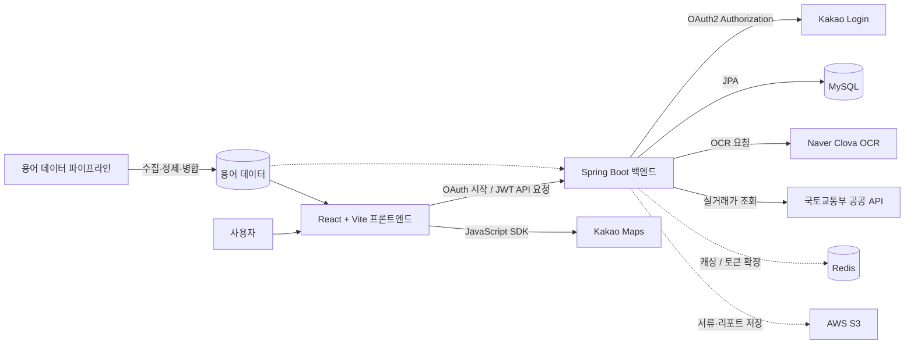

# ZIPT — 전세 계약 안전 분석 및 인프라 통합 서비스

> **사회초년생과 부동산 초보자를 위한 등기부등본 위험 분석 및 선호 생활 인프라 통합 제공 서비스**

 

## 📌 프로젝트 소개

**ZIPT**는 복잡하고 어려운 부동산 등기부등본 정보를 직관적인 언어로 풀어 설명하고, 매물의 전세사기 위험도를 사전에 분석하여 사용자가 안전하게 전세 계약을 진행하도록 돕는 플랫폼입니다. 이에 더해 매물 주변의 다양한 생활 인프라 정보와 사용자의 개인 선호 조건을 결합한 개인 맞춤형 지도를 제공합니다.

### ⚠️ 기존 시장의 문제점 및 ZIPT의 해결책
1. **어려운 법률 용어**: 등기부등본의 갑구·을구, 근저당권, 선순위 채권 등 어려운 용어 $\rightarrow$ **ZIPT의 쉬운 말 번역 및 행동 지침 제공**
2. **위험도 직접 계산의 한계**: 보증금과 근저당권을 공시가 대비 비교 분석 $\rightarrow$ **LTV, 선순위채권 비율을 기준으로 한 자동 위험 등급 산출**
3. **파편화된 정보 검색**: 매물 따로, 주변 인프라(학군, 교통, 병원 등) 따로 조회 $\rightarrow$ **Kakao Maps 기반의 개인 선호도 필터 인프라 지도 제공**

---

## 🛠️ 주요 기능 (Key Features)

### 1. 등기부등본 OCR 분석 & 위험도 계산
* **Naver Clova OCR**을 활용해 등기부등본의 갑구/을구 스캔 이미지에서 근저당권 설정, 선순위 채권액 정보를 추출합니다.
* 보증금, 선순위채권, 공시가격을 대조하여 LTV(담보인정비율)를 구하고, **HUG 전세보증보험 가입 가능 조건** 및 위험 등급(안전/주의/위험)을 판별합니다.

### 2. 부동산 초보자 전용 용어 사전 연동
* 런타임에 호출되는 어려운 부동산 단어들(근저당권 등)을 즉시 조회하여 팝업이나 쉬운 설명으로 제공합니다.
* Spring Boot 기동 시 자동으로 적재되는 용어 시드 데이터 기반으로 안정적인 사전 조회를 지원합니다.

### 3. 개인 선호 인프라 지도 (Infra Map)
* **Kakao Maps SDK**와 공공 데이터를 연동하여 매물 주변의 교통, 대형마트, 병원, 힐링 인프라 정보를 시각화합니다.
* 사용자가 본인의 우선순위(예: 역세권, 병원 필수 등)를 설정하면 가중치를 반영한 매물 점수를 계산해 제공합니다.

---

## ⚙️ 기술 스택 (Tech Stack)

### Client
* **Framework**: React (Vite)
* **Styling**: SCSS (CSS Modules), Tokens 기반 테마
* **Build Tool**: Vite
* **Libraries**: React Router v6, Kakao Maps API

### Server
* **Framework**: Spring Boot (Java 17)
* **Security & Auth**: Spring Security, JWT (Json Web Token)
* **Database**: MySQL, Redis (캐싱 및 토큰 관리)
* **ORM & Data**: Spring Data JPA
* **Cloud Storage**: AWS S3 (서류 및 리포트 저장)
* **External APIs**: Naver Clova OCR API, 국토교통부 실거래가 조회 공공 API

---

## 📐 시스템 아키텍처 (System Architecture)

---

## 📂 5. 프로젝트 상세 문서 (상세 내용 확인)

ZIPT 프로젝트는 모든 설계 및 작업 일지를 도큐멘테이션하여 관리하고 있습니다. 아래 링크에서 상세 내용을 확인하실 수 있습니다.

- 📝 [PROJECT LOG (전체 문서 통합 인덱스)](documents/PROJECT_LOG.md)
- 📋 [PROJECT SPECIFICATION (기획안 상세 분석서)](documents/info/프로젝트%20기획.md)
- 🏗️ [PROJECT PRESENTATION (ZIPT 기획 발표 문서)](documents/info/ZIPT_프로젝트_기획_발표_문서.md)
- 📐 [IMPLEMENTATION GUIDELINE (기능 구현 가이드라인)](documents/info/🏠도연_프로젝트%20기능%20구현%20가이드라인.md)
- 🏗️ [INFRA BRIEFING (인프라 구조 브리핑)](documents/info/인프라%20브리핑.md)
- 🚨 [TROUBLESHOOTING (CORS 및 라우팅 에러 해결 색인)](documents/TROUBLESHOOTING.md)
- 📋 [INTEGRATION PLAN (마이페이지 연동 구현 계획서)](documents/plan/mypage_contract_integration_plan.md)
- 🎯 [SYNC GUIDE (용어 사전 동기화 가이드)](documents/guides/term_sync_test_guide.md)

---
*Updated at_2026.07.23*
